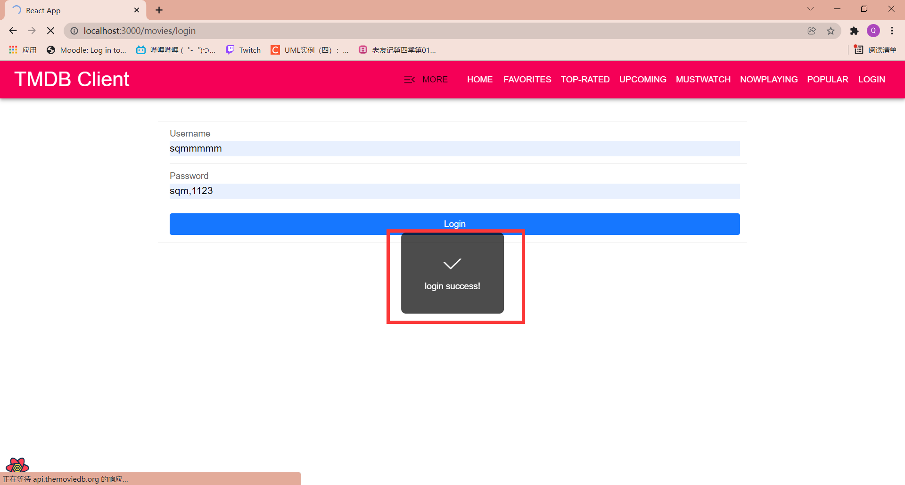

# Assignment 1 - ReactJS app.

Name: [Qiming Shi]

## Overview.

[A brief statement on the content of this repository.]

### Features.

+ Feature 1-Provides the ability to login to authenticate TMDB accounts
+ Feature 2-Information and pictures of actors have been added to the details of the movies
+ Feature 3-Added popular movies interface, and can add movies to want to watch
+ Feature 4-Added top-rated movies interface, and can add movies to want to watch
+ Feature 5-Added nowplaying movies interface, and can add movies to want to watch
+ Feature 6-Added a web page to search for actors, basically similar to movies
+ Feature 7-Added company search to search for company logos
+ Feature 8-Added TV search, which shows TV with similar keywords
+ Feature 9-Added a more list at the top to arrange more buttons

## Setup requirements.

Add"dependencies":"antd-mobile": "^5.0.0-rc.4", (---for UI)

Use 'npm install' to download node_modules

## API Endpoints

- https://api.themoviedb.org/3/movie/${id}/credits  -get actors info in the movie details screen
- https://api.themoviedb.org/3/person/popular - get a list of popular actors.
- https://api.themoviedb.org/3/person/${id}/images -get images for actors
- https://api.themoviedb.org/3/movie/upcoming -get upcoming movies
- https://api.themoviedb.org/3/movie/now_playing -get now_playing movies
- https://api.themoviedb.org/3/movie/top_rated -get top_rated movies
- https://api.themoviedb.org/3/movie/popular -get popular movies
- https://api.themoviedb.org/3/search/company -get to search company info
- https://api.themoviedb.org/3/search/tv -get to search TV info
- https://api.themoviedb.org/3/authentication/token/new -Create a temporary request token that can be used to validate a TMDB user login
- https://api.themoviedb.org/3/authentication/token/validate_with_login -Validate a request token by entering a username and password.
- https://api.themoviedb.org/3/authentication/session/new -Create a fully valid session ID once a user has validated the request token
- https://api.themoviedb.org/3/account -get account details

### Component catalogue.

> Shows what I can display on my current home page, basically in the header_site. The interface can be jumped through buttons.

> The login page is shown in the figure above.

> Enter the correct TMDB account and password and click login

> Successful login popover

> If input wrong account password

> Login failure popover

> After successfully logging in, you can choose to log out

> Click the MoreInfo button in any movie pages

> In the movie details page, there are pictures of the actors involved in the movie.

> Review is still displayed as a drop-down menu

> When you choose to like

>Change after clicking the "Like" button

> A list of upcoming movies

> Using the filter, enter the movie name that contains "a" and select the option that belongs to the family category.

> The buttons in this section are used to add movies to the list you want to see

>After clicking on the first two movies, click on the Mustwatch button to enter the page and view the movies that have been added to the list.

>There's not much more to say about similar pages.

>Click the "more" button at the top to display clickable links from the side. This includes some links that already exist in Headsiter, as well as some content that is not particularly relevant to the movie.

> This is an actor page similar to a movie page.

> It retains the ability to retrieve actors, as well as a movie card-like function.

> This page is used to search for TV names and find similar shows,It displays the corresponding TV series only after the keyword is entered.

> Enter keywords and it will display the corresponding TV series, along with posters and a brief introduction.

> Similar to TV, the company section also provides corresponding search.

> Enter the keywords and the page will provide the corresponding company icon

## Routing.

+ Discover list of movies - discover/movie

+ Movie details - movie/:id

+ Movie genres = /genre/movie/list

+ Movie popular = /movies/popular(same like upcoming ,top_rated, nowplaying)

+ Login page = /movies/login

+ Actors page = /actors

+ Search TV = /movies/tv(like Company)

  

## Independent learning

> UI Libraries called antd-mobile

> I have also gained experience in sending post requests to websites

# Assignment 1 - Agile Software Practice.

Name: [Qiming Shi]

## App Features.

- Upcoming Movies page - Shows the upcoming movies. The header of this page should be Upcoming Movies. The movie title filter and genre function should run successfully.

Tests: cypress/integration/upcoming-page.spec.js

+ Toprated Movies page - Shows the toprated movies. The header of this page should be Toprated Movies. The movie title filter and genre function should run successfully.

Tests: cypress/integration/toprated-page.spec.js

+ Nowplaying Movies page - Shows the nowplaying movies. The header of this page should be Nowplaying Movies. The movie title filter and genre function should run successfully.

Tests: cypress/integration/nowplaying-page.spec.js

+ Actors page - Shows Actors. The header of this page should be Discover Actors. The actor  filter should run successfully.

Tests: cypress/integration/actor-page.spec.js

+ More button - Clicking this button should successfully jump to the target page from all the links which has set up.

Tests: cypress/integration/more-list.spec.js

+ Login Page-The login interface should be tested based on whether the user name and password entered can be logged in successfully. After successful login, the login button will become logout. If the login fails, it will remain unchanged.

Tests: cypress/integration/login-page.spec.js

+ Gitlab：

  